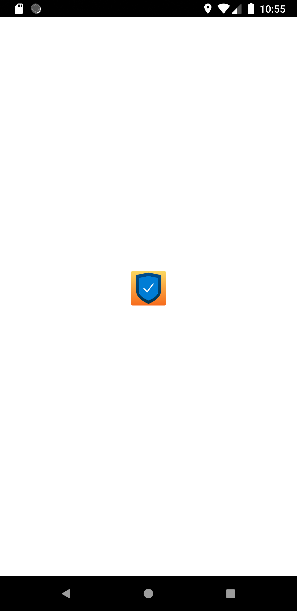

# vpn_app

Simple Vpn app concept UI done in Flutter.

## ❤️ Found this project useful?
If you found this project useful, then please consider giving it a ⭐️ on Github and sharing it with your friends via social media.

 

## Prerequisites
If you are new to Flutter, please first follow the [Flutter Setup](https://flutter.dev/docs/get-started/install) guide.

## Run the Flutter app locally
1. git clone https://github.com/nmanikiran/vpn_app.git
1. cd vpn_app
1. `flutter pub get`
1. run `flutter doctor` make sure everything is checked
1. `flutter run` will launch the app in Device / Emulator

> The `flutter run --release` command both builds and installs the Flutter app.

# Screenshots

 |
 |
 |
 |
 |

## Contributing
Awesome! Contributions of all kinds are greatly appreciated. To help smoothen the process we have a few non-exhaustive guidelines to follow which should get you going in no time.

## Using GitHub Issues
1. Feel free to use GitHub issues for questions, bug reports, and feature requests
1. Use the search feature to check for an existing issue
Include as much information as possible and provide any relevant resources (Eg. screenshots)
1. A pull request with a breaking test would be super preferable here but isn't required

## Submitting a Pull Requests
I welcome and encourage all pull requests. It usually will take me within 24-48 hours to respond to any issue or request. Here are some basic rules to follow to ensure timely addition of your request:

1. Match the document style as closely as possible.
1. Please keep PR titles easy to read and descriptive of changes, this will make them easier to merge :)
1. Pull requests must be made against master branch for this particular repository.
1. Check for existing [issues](https://github.com/nmanikiran/vpn_app/issues) first, before filing an issue.
1. Make sure you follow the set standard as all other projects in this repo
1. Have fun!

## Created & Maintained By
[Mani Kiran](https://github.com/nmanikiran) | [@nmanikiran](https://twitter.com/nmanikiran)

Feel free to reach out to me through [@nmanikiran](https://twitter.com/messages/1564952526-1564952526) if you have any questions or feedback! 😊

## Thanks & Credits

Idea / Concepts is take from [here](https://project365.design/2018/10/05/day-278-vpn-mobile-app-ui-kit-sketch-freebie/), assets taken from [React-ui-kit](https://github.com/react-ui-kit/dribbble2react/tree/master/vpn-app)

