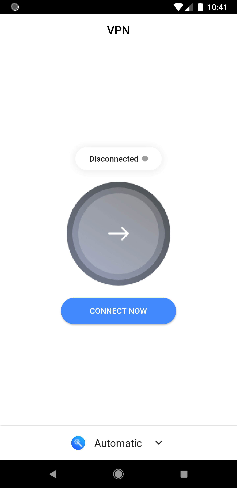
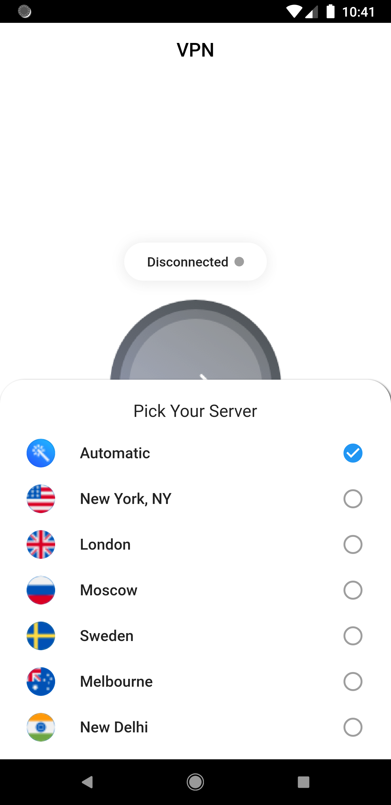
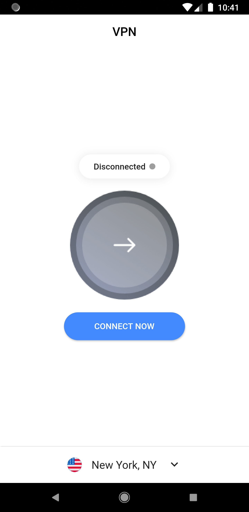

# vpn_app

Simple Vpn app concept UI done in Flutter.

## Thanks & Credits
Idea / Concepts is take from [here](https://project365.design/2018/10/05/day-278-vpn-mobile-app-ui-kit-sketch-freebie/), assets taken from [React-ui-kit](https://github.com/react-ui-kit/dribbble2react/tree/master/vpn-app)

| {width=250px}   | {width=250px} | {width=250px} | {width=250px} |
